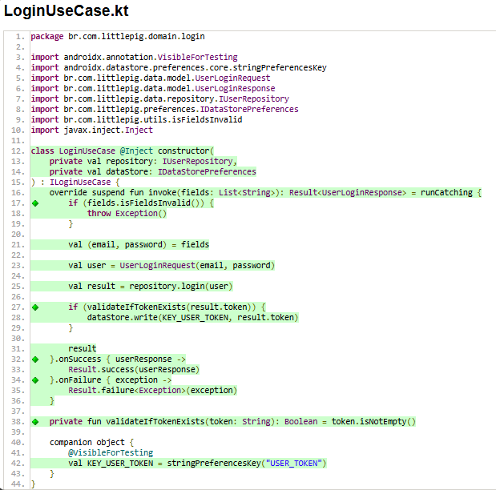
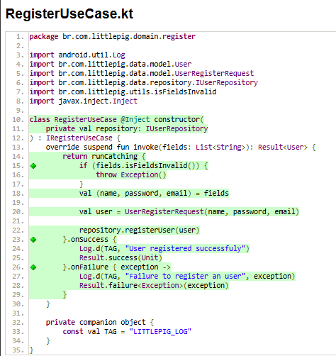

# 📘 Documentação: Regras de Negócio e Testes

Este documento detalha as regras de negócio implementadas nos casos de uso de **Login** (`LoginUseCase`) e **Cadastro** (`RegisterUseCase`), bem como a cobertura de testes unitários para garantir seu correto funcionamento.

---

## Contexto do projeto

O LittlePig se trata de um aplicativo de organização financeira, tendo a possibilidade de registrar entradas e saídas de dinheiro
e também a visualização do saldo como um todo, o que entrou no dia específico e o que saiu.

Atualmente o app ainda continua em desenvolvimento, portanto apenas o registro e login de usuário estão aptos a serem testados.

## 🚀 Como Rodar o Projeto

Este projeto depende de uma **API externa** que precisa ser configurada antes da execução do app.

### 🔗 1. Clone o repositório da API

```bash
git clone https://gitlab.com/DevRafaelSa/uniesp-financas-backend
```

## ⚙️ 2. Configure e inicie a API

Dentro da pasta da API: npm install

# Roda as migrations e sobe o banco
npx prisma migrate dev

# Inicia o servidor
npm run dev

## 📱 3. Rode o app Android

Abra o projeto no Android Studio

Clique em Run ou use o atalho Shift + F10

Certifique-se de que a API esteja ativa antes de rodar o app.

## 🧪 Como Rodar os Testes

Execute os testes unitários com:

```
./gradlew test
```

## ✅ Gerar Relatório de Cobertura com JaCoCo

Para gerar relatório de cobertura (linhas testadas):

```
./gradlew testDebugUnitTest jacocoTestReport
```

O relatório HTML será gerado em:

app/build/reports/jacoco/jacocoTestReport/html/index.html

Abra esse arquivo no navegador para visualizar o que foi ou não testado.

## 🔐 Login - `LoginUseCase.kt`

O `LoginUseCase` é responsável por orquestrar a lógica de autenticação do usuário na aplicação.

### 📋 Regras de Negócio

1. **Validação de Campos**
    - Antes de prosseguir com o login, o caso de uso valida se os campos necessários (como email e senha) **não estão vazios**.
    - Se algum campo for inválido, a operação **falha imediatamente**.

2. **Execução do Login**
    - Com campos válidos, o `UseCase` invoca o `IUserRepository` para realizar a chamada de login na API, enviando as credenciais do usuário.

3. **Tratamento de Sucesso**
    - Se a API retornar sucesso:
        - O `UseCase` recebe os dados do usuário, **incluindo um token de autenticação**.
        - **Persistência do Token:** O token recebido é salvo no `IDataStorePreferences` para manter a sessão ativa.
        - O token **só é salvo se for uma string válida (não vazia)**.

4. **Tratamento de Falha**
    - Se a chamada ao repositório falhar (ex: credenciais incorretas, erro de servidor), o `UseCase` **captura a exceção** e retorna um `Result.failure`, impedindo o login.

---

## 🧪 Testes Unitários - `LoginUseCaseTest.kt`

Os testes para o `LoginUseCase` garantem que todas as regras de negócio sejam cumpridas em diferentes cenários:

---

### ✅ `Should throw exception when fields is invalid`

- **O que testa:** Verifica se a operação de login **falha** (`result.isFailure`) quando os campos estão vazios.
- **Cenário:** Simula o usuário tentando fazer login sem preencher os dados.

---

### ✅ `Should login when fields is valid`

- **O que testa:** Garante que o `UseCase` retorna um `Result.success` quando:
    - Os campos são válidos
    - A chamada ao repositório é bem-sucedida
- **Cenário:** Simula um login bem-sucedido.

---

### ✅ `Should save token when is valid`

- **O que testa:** Confirma que `dataStore.write(...)` é chamado **exatamente uma vez** para salvar o token quando o login tem sucesso e o token é válido.
- **Cenário:** Simula um login bem-sucedido onde a API retorna um token não vazio.

---

### ✅ `Should not save token when is invalid`

- **O que testa:** Assegura que o token **não é salvo** (`dataStore.write` é chamado **zero vezes**) se:
    - O login foi bem-sucedido
    - **Mas** o token retornado pela API é vazio
- **Cenário:** Protege contra tokens inválidos que poderiam corromper o estado de autenticação.

---

### ✅ `Should throw exception when login is not successfull`

- **O que testa:** Verifica se o `UseCase` retorna `Result.failure` quando a chamada `repository.login()` lança uma exceção.
- **Cenário:** Simula falhas como:
    - Credenciais incorretas
    - Erro de rede
    - Falha de servidor

---

## 📝 Cadastro - `RegisterUseCase.kt`

O `RegisterUseCase` é responsável por gerenciar a lógica de criação de um novo usuário na aplicação.

---

### 📋 Regras de Negócio

1. **Validação de Campos**
    - Antes de tentar criar um usuário, o `UseCase` verifica se a lista de campos (`fields`) contém **strings vazias**.
    - Se qualquer um dos campos essenciais estiver inválido (vazio), a operação é **interrompida** e retorna uma falha (`Result.failure`).

2. **Execução do Cadastro**
    - Com os campos validados, o `UseCase` agrupa as informações (nome, senha, e-mail, etc.).
    - Em seguida, invoca o `IUserRepository` para realizar a chamada de criação do usuário na API.

3. **Tratamento de Sucesso**
    - Se a API registrar o usuário com sucesso e retornar os dados do novo usuário:
        - O `UseCase` repassa esse resultado positivo para a camada de apresentação (`Result.success` com `User`).

4. **Tratamento de Falha**
    - Se a chamada ao repositório falhar:
        - Ex: e-mail já existente, erro de servidor, exceção qualquer
        - O `UseCase` captura o erro e retorna um `Result.failure`, informando que o cadastro **não pôde ser concluído**.

---

## 🧪 Testes Unitários - `RegisterUseCaseTest.kt`

Os testes unitários do `RegisterUseCase` asseguram que o fluxo de cadastro de usuário se comporta como esperado em diferentes cenários:

---

### ✅ `Should throw exception when fields is invalid`

- **O que testa:**  
  Garante que o caso de uso retorne uma falha (`result.isFailure`) quando a lista de campos contém pelo menos **uma string vazia**.

- **Cenário:**  
  Simula um usuário tentando se cadastrar **sem preencher todos os campos obrigatórios**.

---

### ✅ `Should register an user when fields is valid`

- **O que testa:**  
  Verifica se o caso de uso retorna um `Result.success` contendo um objeto `User` quando:
    - Os campos são válidos
    - A chamada ao repositório `repository.registerUser(...)` é bem-sucedida

- **Cenário:**  
  Simula o fluxo completo de um **cadastro realizado com sucesso**.

---

### ✅ `Should throw exception when user not created`

- **O que testa:**  
  Assegura que o caso de uso retorna uma falha (`result.isFailure`) se a chamada ao `repository.registerUser(...)` lançar uma exceção.

- **Cenário:**  
  Simula situações de erro como:
    - E-mail já está em uso
    - Falha de conexão com o servidor
    - Outras falhas da API

---


